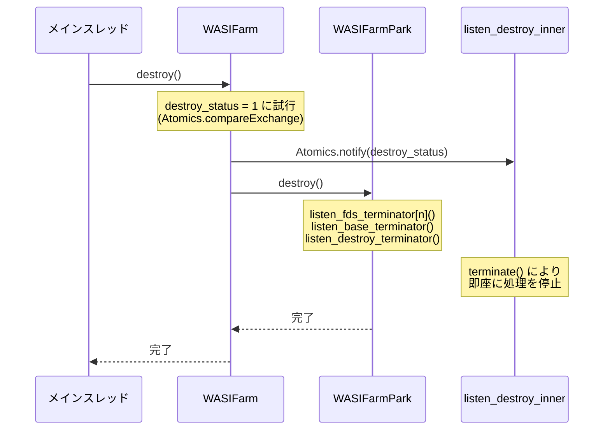
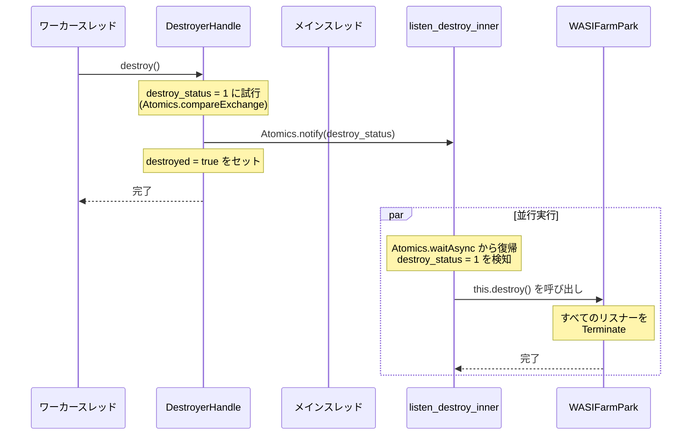
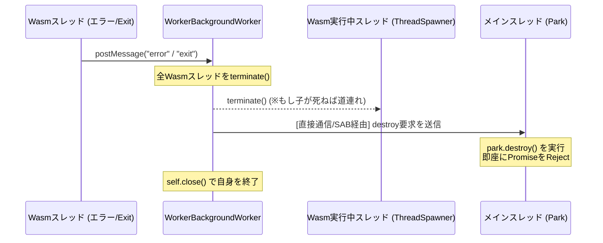
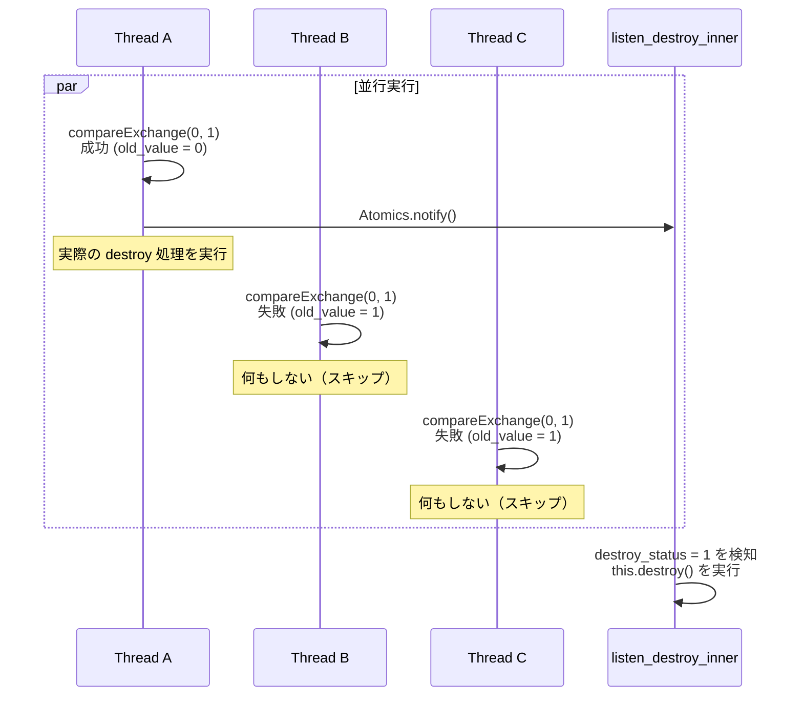

# destroy() のスレッドごとのフローと設計方針

## 背景と課題の整理
ユーザーのご指摘の通り、`Atomics.waitAsync` で待機している `listen_base_inner` などの関数は、待機状態から自発的に抜け出すこと（内部の `if` によるループ脱出）に頼るべきではありません。
Wasmを実行してブロックされているスレッドからは `Atomics.notify` が送られてこない可能性があり、その場合は永遠に待機し続けることになります。

よって、**「内部のフラグ（if）で綺麗に終了させる」のではなく、「外側から関数（非同期タスク）を強制的に殺す（Promiseをrejectして終了として扱う）」** アプローチを取り、Wasmを実行しているスレッド（Worker）自体も直接Terminate（殺す）アプローチを取ります。

## destroy 元のスレッドごとのフロー

### パターンA: メインスレッド（またはWASIFarmを生成した親スレッド）から `destroy()` が呼ばれた場合

メインスレッドはWasmによるブロックを受けていないため、自身でリソースの強制終了を指揮します。

1. **destroy_status フラグの更新**: `Atomics.compareExchange` で 0→1 に試行
   - 成功: 自分がフラグを立てた → 以下の処理を実行
   - 失敗: 他のスレッドが既に destroy 中 → スキップ
2. **待機中のスレッドを起動**: `Atomics.notify` で listen_destroy_inner を起動
3. **Park のリスナー関数の強制終了**: `park.destroy()` を呼び出し、すべてのリスナーを即座に terminate する
4. **参照削除**: `park = null` で park への参照を削除

### パターンB: 子スレッド（Wasm実行中/実行前後）から `destroyer.destroy()` が呼ばれた場合

子スレッドから呼び出された場合、`destroy_status` フラグを通じてメインスレッド側に destroy を通知します。

1. **DestroyerHandle.destroy() の実行**: ワーカースレッドから呼び出し
2. **destroy_status フラグの更新**: `Atomics.compareExchange` で 0→1 に試行
   - 成功: 自分がフラグを立てた → Atomics.notify でメインスレッドを起動
   - 失敗: 他のスレッドが既に destroy 中 → スキップ
3. **destroyed フラグの設定**: 自身の状態を記録
4. **メインスレッド側での自動処理**:
   - listen_destroy_inner が destroy_status = 1 を検知
   - this.destroy() を呼び出し、すべてのリスナーを terminate

## 追加要件への対応方針

### 1. Parkリスナーの即座なReject
`Atomics.waitAsync` が永遠に返ってこない問題に対して、Parkリスナー（`listen_base_inner`等）を「即座にRejectする」仕組みを導入します。
メインスレッド側で `park.destroy()` が呼ばれた時点で、`wrap_async` が保持している `terminator()` を実行し、Promise を直ちに Reject させます。これにより、内部の `Atomics.waitAsync` は放置されますが、呼び出し元（Main側）の非同期フローはブロックされずに即座にエラーとして終了（キャンセル）されます。

### 2. WorkerBackgroundWorker から destroy が来た際のフロー
Wasmスレッドがエラーやexitを起こした場合、`WorkerBackgroundWorker` が主体となって `destroy` を開始します。
Wasmを実行しているスレッド（`worker.ts`など）はイベントループがブロックされており `postMessage` を受け取れないため、**WorkerBackgroundWorker からメインスレッド（Parkのいるスレッド）へ直接 `MessagePort` 等を用いて「destroy指令」を送る** か、あるいは **SharedArrayBuffer 上に `destroy_status` フラグを設けて、メインスレッド側がそれを検知する（またはAtomicsでParkを直接起こしてRejectさせる）** 必要があります。

今回は、最も確実な「WorkerBackgroundWorker が全スレッドを強制終了した後、メインスレッド側のParkにRejectを促す」フローを構築します。

### 3. 同時に複数から destroy を要請された際の競合対処

複数のスレッドから同時に destroy が呼ばれた場合、Atomics.compareExchange により以下のように制御されます：

**詳細**:
- **初期状態**: `destroy_status = 0`
- **Thread A**: `compareExchange(0, 1)` → 成功 → destroy 処理を実行 → `Atomics.notify()` で listener を起動
- **Thread B**: `compareExchange(0, 1)` → 失敗 (old_value = 1) → スキップ
- **Thread C**: `compareExchange(0, 1)` → 失敗 (old_value = 1) → スキップ

**結果**: Thread A だけが実際の destroy 処理を進め、B, C は destroy 中であることを認識して即座に return

## 今後の実装予定のアクション（提案）

- [NEW] `SharedArrayBuffer` に `destroy_status` フラグを追加し、競合を制御します。
- [DELETE] `park.ts` の `listen_base_inner` 等における、正常終了用の `if` (`case 1`) ロジックを完全に削除します。
- [MODIFY] `park.destroy()` が呼ばれたら即座に Promise を Reject させ、関数を強制キャンセルさせます。
- [MODIFY] `WorkerBackgroundWorker` からメインスレッド（Park側）に対して直接 destroy を通達できる経路（例えば MessagePort の転送、または SAB 経由の直接通知と Main 側での強制検知）を実装します。

## User Review Required

> [!IMPORTANT]
> **WorkerBackgroundWorker からメインスレッドへの通知経路について**
> Wasm実行スレッドがブロックされているため、`WorkerBackgroundWorker` が直接メインスレッドに `destroy`（Parkの即座Reject）を伝える必要があります。
> 1. `WASIFarm` 初期化時に `MessageChannel` を作成し、片方のPortを WorkerBackgroundWorker に渡し、直接 `postMessage` を送ってメインスレッドに `park.destroy()` を呼ばせるアプローチ
> 2. `WASIFarmRef` に `destroy` をトリガーする専用の Atomics.notify 用領域（あるいは既存の base_func_util）を設け、WorkerBackgroundWorkerがそれに書き込んで Park を起こし、自死させるアプローチ
>
> どちらのアプローチを採用すべきか、ご意見をいただけますでしょうか？（1番のMessagePort渡しが確実ですが、アーキテクチャ的に2番のSABを利用する方が望ましい場合はそちらで進めます）
